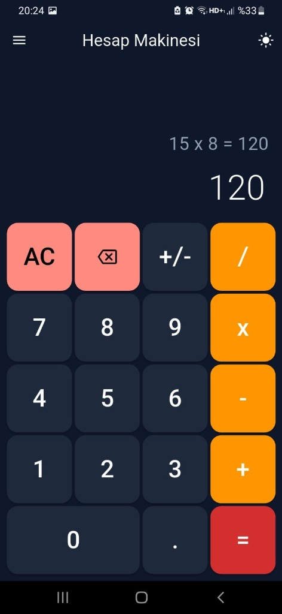
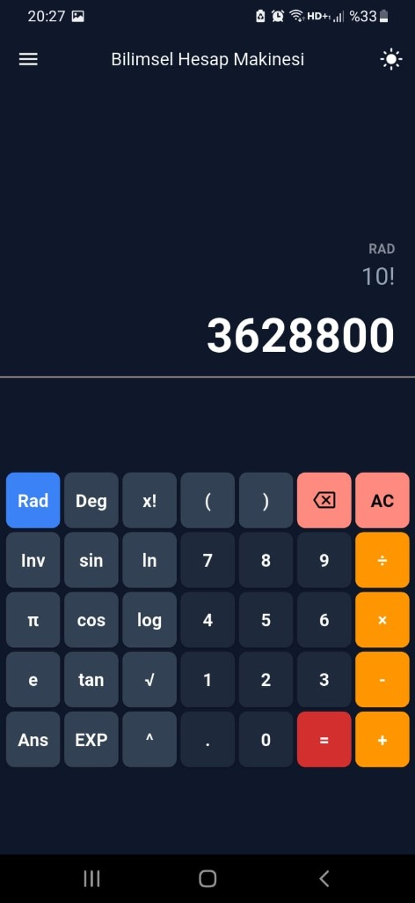
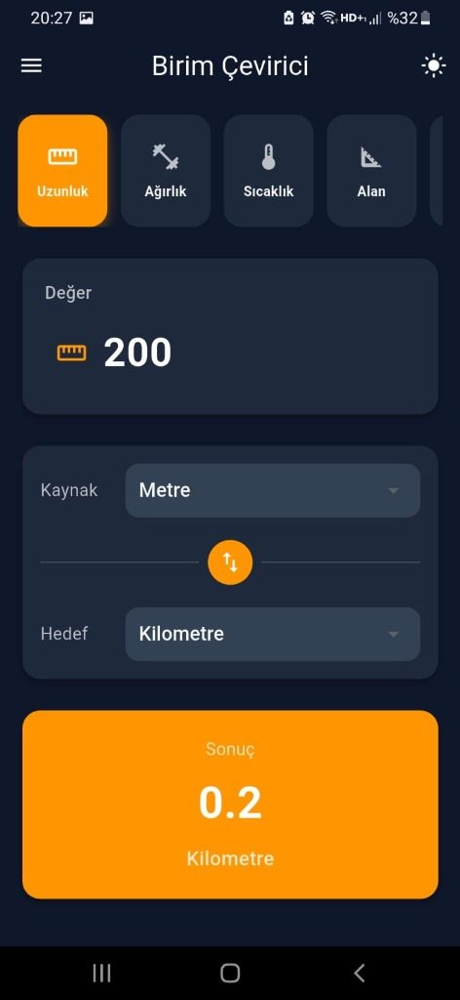

# Hesap Defterim

Çok fonksiyonlu hesap makinesi ve birim çevirici uygulaması.

## Özellikler

- ✅ **Hesap Makinesi** - Temel matematiksel işlemler
- ✅ **Bilimsel Hesap Makinesi** - Sin, cos, tan, log, faktöriyel ve daha fazlası
- ✅ **Birim Çevirici** - Uzunluk, ağırlık, sıcaklık, alan, hacim, hız, zaman, veri dönüşümleri
- ✅ **Altın & Gümüş Fiyatları** - Anlık altın ve gümüş fiyatları
- ✅ **Karanlık/Aydınlık Mod** - Göz dostu tema seçenekleri
- ✅ **Titreşim & Ses Efektleri** - Kullanıcı deneyimini artıran geri bildirimler

## Ekran Görüntüleri

<p align="center">
  
  
  
</p>

<p align="center">
  
  
</p>

## Kurulum

```bash
flutter pub get
flutter run
```

## Teknolojiler

- Flutter
- Dart

## Lisans

Bu proje MIT lisansı altında lisanslanmıştır.
