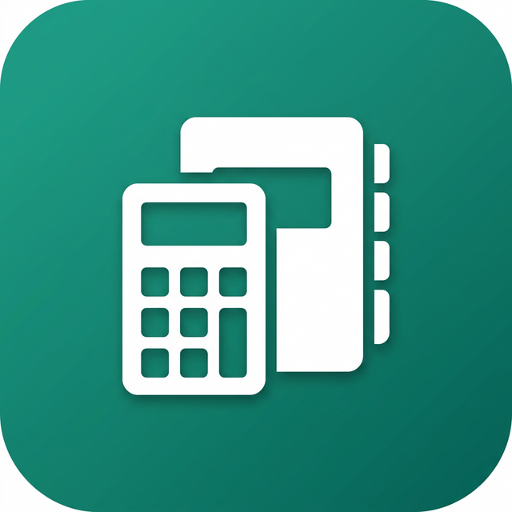

# 🧮 Hesap Defterim

<p align="center">
  
</p>

<p align="center">
  <b>Çok Amaçlı Hesaplama Aracı</b><br>
  Hesap makinesi, döviz çevirici, birim çevirici ve hesap defteri tek uygulamada!
</p>

<p align="center">
  
  
  
</p>

---

## ✨ Özellikler

### 📱 Temel Hesap Makinesi
- Dört işlem (toplama, çıkarma, çarpma, bölme)
- İşaret değiştirme (+/-)
- Ondalık sayı desteği
- Anlık sonuç görüntüleme

### 🔬 Bilimsel Hesap Makinesi
- Trigonometrik fonksiyonlar (sin, cos, tan)
- Ters trigonometrik fonksiyonlar
- Logaritma (ln, log)
- Üstel işlemler
- π ve e sabitleri
- Radyan/Derece modu
- Faktöriyel hesaplama

### 💱 Para Birimi Çevirici
- 25+ para birimi desteği
- **Canlı döviz kurları** (API entegrasyonu)
- Anlık çeviri
- Takas butonu ile hızlı işlem
- Çevrimdışı mod desteği

### 📏 Birim Çevirici
| Kategori | Birimler |
|----------|----------|
| Uzunluk | Metre, Kilometre, Mil, İnç, Fit... |
| Ağırlık | Kilogram, Gram, Pound, Ons... |
| Sıcaklık | Celsius, Fahrenheit, Kelvin |
| Alan | Metrekare, Hektar, Dönüm... |
| Hacim | Litre, Galon, Metreküp... |
| Hız | m/s, km/h, mph, Knot |
| Zaman | Saniye, Dakika, Saat, Gün... |
| Veri | Byte, KB, MB, GB, TB |

### 📒 Hesap Defteri
- Önemli hesaplamaları kaydetme
- Not ekleme özelliği
- Düzenleme ve silme
- Geçmiş işlemleri deftere aktarma

### 🎨 Tasarım
- 🌙 Karanlık tema
- ☀️ Aydınlık tema
- Modern ve minimalist arayüz
- Kolay navigasyon için Drawer menü

---

## 📸 Ekran Görüntüleri

<p align="center">
  <i>Ekran görüntüleri yakında eklenecek...</i>
</p>

---

## 🚀 Kurulum

### Gereksinimler
- Flutter SDK (3.9.0+)
- Dart SDK (3.0.0+)
- Android Studio / VS Code

### Adımlar

```bash
# Repo'yu klonla
git clone https://github.com/suleymanbdn/hesap-defterim.git

# Dizine gir
cd hesap-defterim

# Bağımlılıkları yükle
flutter pub get

# Uygulamayı çalıştır
flutter run
```

---

## 📦 Build

### Android APK
```bash
flutter build apk --release
```

### Android App Bundle (Play Store için)
```bash
flutter build appbundle --release
```

---

## 🛠️ Kullanılan Teknolojiler

- **Flutter** - UI Framework
- **Dart** - Programlama Dili
- **SharedPreferences** - Yerel veri saklama
- **HTTP** - API istekleri
- **Math Expressions** - Matematiksel işlemler

---

## 📁 Proje Yapısı

```
lib/
├── main.dart                    # Uygulama giriş noktası
├── anasayfa.dart               # Ana hesap makinesi
├── bilimsel_hesap_makinesi.dart # Bilimsel hesap makinesi
├── para_birimi_cevirme.dart    # Döviz çevirici
├── birim_cevirme.dart          # Birim çevirici
├── gecmis_sayfasi.dart         # Hesaplama geçmişi
├── defter_sayfasi.dart         # Hesap defteri
├── ayarlar_sayfasi.dart        # Ayarlar
└── drawer_widget.dart          # Yan menü widget'ı
```

---

## 👨‍💻 Geliştirici

**Geliştirici:** Süleyman Büdün

**Yayıncı:** SuBuSoft

- GitHub: [@suleymanbdn](https://github.com/suleymanbdn)

---

## 📄 Lisans

Bu proje MIT lisansı altında lisanslanmıştır. Detaylar için [LICENSE](LICENSE) dosyasına bakın.

---

## ⭐ Destek

Eğer bu proje işinize yaradıysa, bir ⭐ vererek destek olabilirsiniz!

---

<p align="center">
  Made with ❤️ by SuBuSoft
</p>
